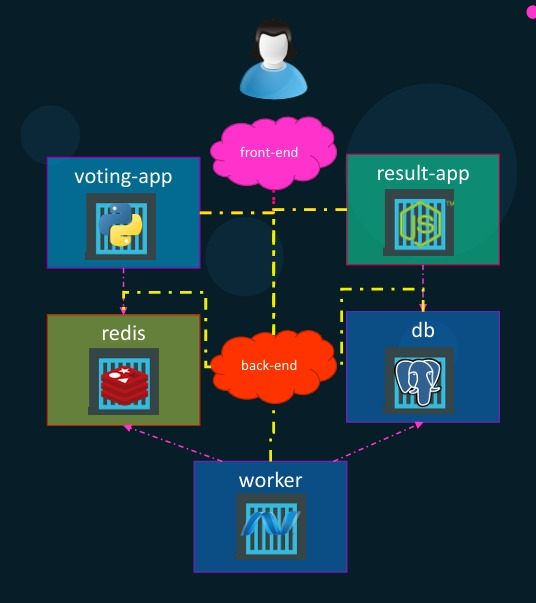
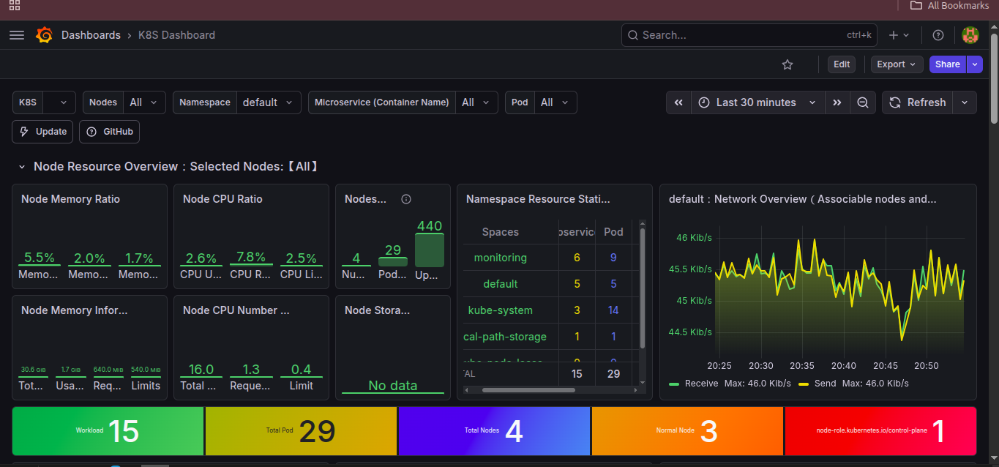
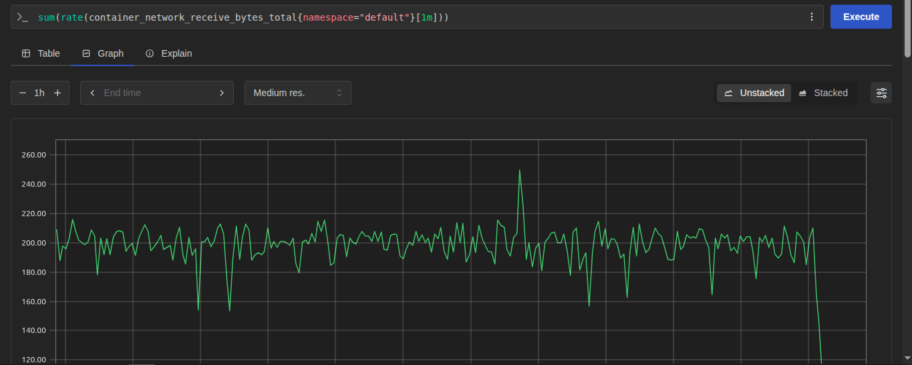

# K8s Kind Voting App

## 🏗️ Application Overview and Architecture

The voting application is composed of several distinct components:

- **Voting App**: A Python-based web application built with Flask, where users cast their votes.

- **Redis**: A messaging system that collects the submitted votes.

- **Worker**: A .NET application (with a Java-like code sample preserved) that processes votes and updates a PostgreSQL database.

- **Result App**: A Node.js and Express application that retrieves and displays voting results from the database.

Note that Redis and PostgreSQL are provided as prebuilt images from Docker Hub, while the Python, .NET, and Node.js applications are custom-developed and organized in separate folders within the repository.

## Architecture



## Observability




## 🚀 Run the Application

### 📁 Navigate to Kubernetes Configuration
```bash
cd k8s-specifications
```
### ⚙️ Apply Kubernetes Configurations
```
kubectl apply -f .
```
### 🔍 Verify Deployments
```
kubectl get all
```
### 🌐 Port Forwarding
##### 🗳️ Vote App
```
kubectl port-forward svc/vote 5000:5000 --address=0.0.0.0
```
##### 🗳️ Result App
```
kubectl port-forward svc/result 5001:5001 --address=0.0.0.0
```
### 🌍 Access Applications in Browser
##### 🗳️ Vote App
```
http://localhost:5000
```
##### 🗳️ Result App
```
http://localhost:5001
```


